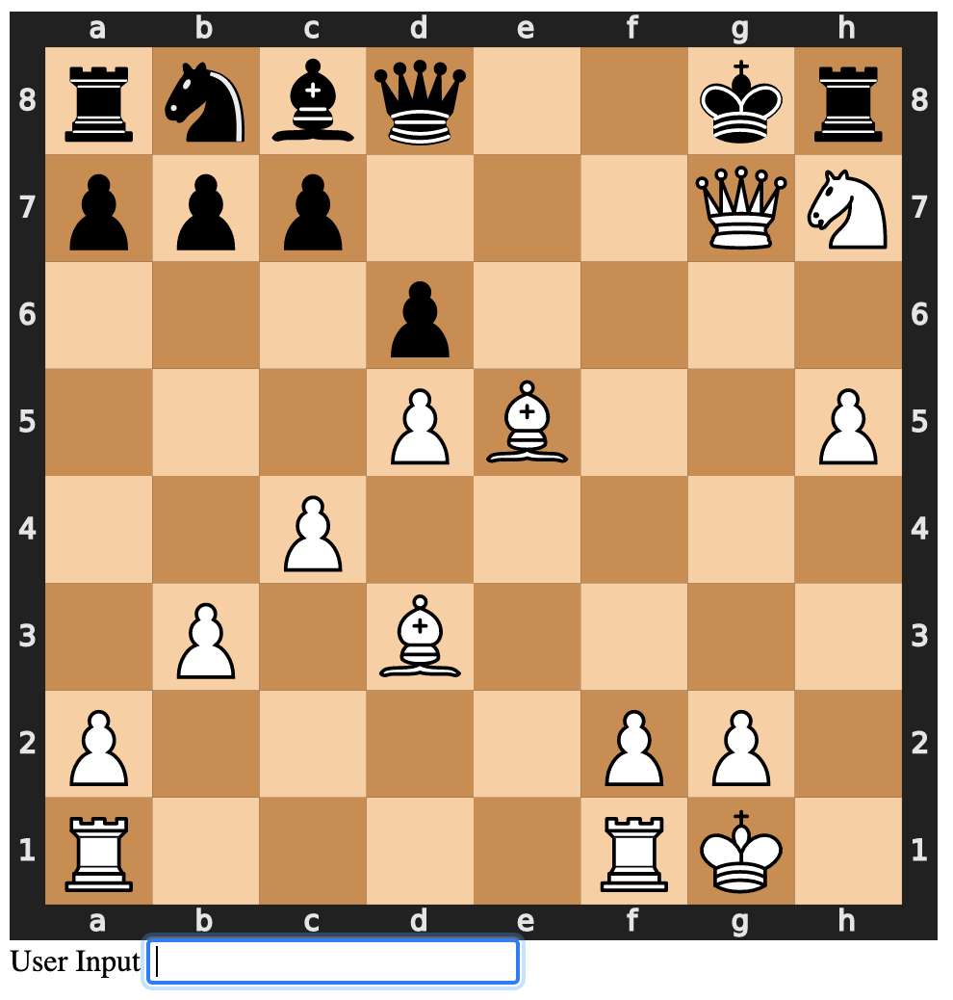

# chess

Clone the repo, and install with `pipenv install`. Then run `pipenv shell; FLASK_APP=main flask run` to run the application. It should open a browser, at which point you can type in Alegraic Notation moves into the form field.

